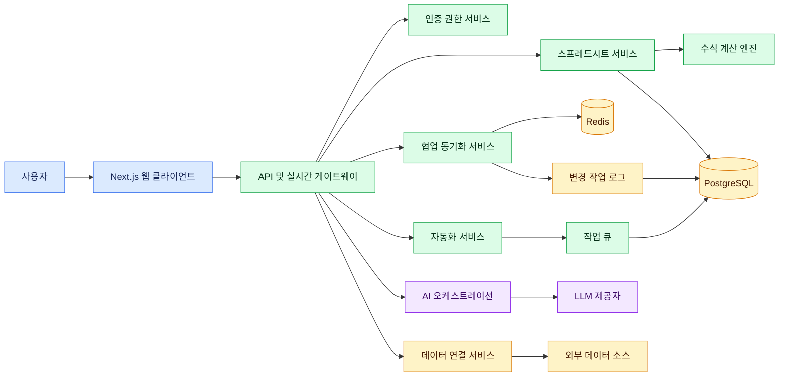

# JaSheets Goal

## 1. 프로젝트 목표

JaSheets는 단순한 Google Sheets 복제 서비스를 넘어, 개인과 조직이 데이터를 입력하고 계산하고 분석하며 협업하고 자동화할 수 있는 **오픈소스 AI 스프레드시트 플랫폼**을 구축하는 것을 목표로 한다.

사용자는 복잡한 설치나 전문적인 데이터 도구 없이 웹 브라우저에서 스프레드시트를 생성하고, 여러 사용자와 실시간으로 공동 편집하며, 자연어를 통해 수식·차트·피벗·데이터 정리·분석 작업을 수행할 수 있어야 한다.

JaSheets의 최종 지향점은 다음과 같다.

> 신뢰할 수 있는 스프레드시트 엔진을 기반으로 협업, 데이터 분석, 업무 자동화와 AI 에이전트를 통합한 독립형 데이터 업무 플랫폼을 제공한다.

---

## 2. 핵심 제품 방향

### 2.1 신뢰할 수 있는 스프레드시트

JaSheets의 모든 기능은 정확한 셀 계산과 안전한 데이터 저장을 기반으로 해야 한다.

- Excel 및 Google Sheets와 호환되는 수식 계산
- 절대 참조, 혼합 참조, 범위 참조와 이름 정의 범위 지원
- 날짜, 시간, 문자열, 숫자 및 오류 값의 일관된 처리
- 순환 참조 탐지와 명확한 오류 표시
- 행과 열 삽입·삭제 시 수식 참조 자동 보정
- 자동 저장, 장애 복구, 버전 이력 및 특정 시점 복원
- 대량 셀 변경의 트랜잭션 처리
- 동시 수정 시 데이터 유실 방지

기능 수보다 계산 정확성과 데이터 내구성을 우선한다.

### 2.2 실시간 협업

여러 사용자가 동일한 문서를 안정적으로 공동 편집할 수 있어야 한다.

- 사용자별 커서, 선택 영역과 접속 상태 표시
- 셀 단위 실시간 변경 동기화
- 네트워크 재연결 후 누락된 변경 자동 복구
- CRDT 기반 충돌 해결
- 댓글, 멘션, 답글과 변경 알림
- 소유자, 편집자, 댓글 작성자, 조회자 권한 제공
- 시트, 범위와 셀 단위 보호
- 공유 링크의 만료일과 접근 범위 설정
- 변경 주체와 변경 내용을 확인할 수 있는 감사 로그

실시간 편집 결과는 클라이언트 접속 순서와 관계없이 최종적으로 동일한 상태로 수렴해야 한다.

### 2.3 AI 기반 스프레드시트

AI는 별도의 부가 기능이 아니라 스프레드시트 작업 전반을 지원하는 기본 인터페이스로 제공한다.

사용자는 자연어로 다음 작업을 요청할 수 있어야 한다.

- 원하는 계산에 적합한 수식 생성
- 기존 수식의 의미와 오류 원인 설명
- 데이터 정리, 분리, 병합과 표준화
- 중복, 이상치, 결측값과 잘못된 형식 탐지
- 차트와 피벗 테이블 생성
- 데이터 요약과 핵심 인사이트 도출
- 분석 결과를 문장이나 보고서 형태로 작성
- 여러 단계의 반복 업무 자동화
- 사용자가 선택한 범위에 대한 질의응답

AI가 데이터를 변경하기 전에는 다음 정보를 제공해야 한다.

- 변경 대상 범위
- 수행할 작업
- 예상 결과
- 영향받는 수식이나 차트
- 실행 전 미리보기

사용자의 승인 없이 원본 데이터를 파괴적으로 변경해서는 안 되며, 모든 AI 변경은 실행 취소와 이력 추적이 가능해야 한다.

### 2.4 데이터 분석 기능

일반 사용자가 별도의 BI 도구 없이 스프레드시트 안에서 데이터를 탐색하고 분석할 수 있도록 한다.

- 정렬, 필터, 필터 보기와 고급 검색
- 조건부 서식
- 데이터 유효성 검사
- 중복 제거와 텍스트 분리
- 피벗 테이블
- 계산 필드와 그룹화
- 다양한 차트와 대시보드
- 슬라이서와 교차 필터
- 기술 통계와 데이터 프로파일링
- 분석 결과의 자동 설명
- 선택 영역 기반 빠른 분석
- 새 데이터 반영 시 자동 새로고침

차트와 피벗은 키보드 조작, 스크린 리더와 모바일 환경에서도 사용할 수 있어야 한다.

### 2.5 업무 자동화 플랫폼

반복적인 스프레드시트 업무를 코드 없이 자동화할 수 있도록 한다.

자동화는 다음 요소로 구성한다.

| 요소      | 설명                                                          |
| --------- | ------------------------------------------------------------- |
| 트리거    | 일정, 셀 변경, 행 추가, 파일 업로드, 웹훅 또는 수동 실행      |
| 조건      | 셀 값, 사용자, 시트 상태, 날짜 또는 수식 결과를 기준으로 분기 |
| 작업      | 셀 변경, 행 추가, 알림, 파일 생성, 외부 API 호출 또는 AI 분석 |
| 실행 이력 | 시작 시간, 종료 시간, 결과, 오류와 변경 데이터를 기록         |
| 재실행    | 실패한 단계부터 안전하게 다시 실행                            |
| 권한      | 자동화별 실행 사용자와 접근 가능한 데이터 범위를 제한         |

자동화 실행은 중복 요청에 안전해야 하며, 무한 반복이나 과도한 외부 호출을 방지해야 한다.

### 2.6 확장 가능한 데이터 연결

JaSheets를 다양한 데이터 소스의 조회·편집·분석 인터페이스로 확장한다.

- CSV, TSV, XLSX, JSON 가져오기와 내보내기
- PostgreSQL, MySQL과 같은 데이터베이스 연결
- REST API와 웹훅 연결
- S3 호환 객체 스토리지 연계
- 외부 데이터의 예약 동기화
- 가져오기 전 데이터 미리보기와 컬럼 매핑
- 데이터 형식 및 스키마 자동 추론
- 연결 정보 암호화
- 읽기 전용과 쓰기 가능 연결 분리
- 데이터 갱신 실패 알림과 재처리

외부 연결 데이터는 출처, 마지막 갱신 시각과 동기화 상태를 사용자가 명확히 확인할 수 있어야 한다.

---

## 3. 사용자 경험 목표

JaSheets의 화면은 한국어를 기본으로 제공하되 다국어 확장이 가능해야 한다.

### 3.1 기본 원칙

- 사용자가 별도의 학습 없이 기존 스프레드시트 경험을 활용할 수 있어야 한다.
- 셀 선택, 입력, 복사, 붙여넣기와 자동 채우기가 자연스럽게 동작해야 한다.
- 모든 주요 기능에 키보드 단축키를 제공한다.
- 작업 결과와 오류 원인을 즉시 확인할 수 있어야 한다.
- 긴 작업은 진행 상태와 취소 기능을 제공한다.
- 모바일과 태블릿에서도 조회와 기본 편집이 가능해야 한다.
- 색상만으로 상태나 오류를 구분하지 않는다.
- 명확한 한국어 라벨과 도움말을 제공한다.

### 3.2 입력 화면 원칙

- 기존 데이터에서 선택해야 하는 값은 자유 입력 대신 셀렉트박스를 사용한다.
- 긴 텍스트나 수식은 편집 전 미리보기와 전체 보기를 제공한다.
- 라벨과 입력 필드의 관계를 시각적으로 명확하게 구성한다.
- 필수값, 허용 형식과 입력 예시를 입력 전에 안내한다.
- 저장 실패 시 사용자가 입력한 내용을 유지한다.
- 파괴적인 작업은 영향 범위를 표시하고 확인 절차를 거친다.

### 3.3 성능 체감 목표

- 일반 문서는 즉시 열리는 수준의 초기 응답성을 제공한다.
- 셀 입력과 선택 이동에서 눈에 띄는 지연이 없어야 한다.
- 화면에 보이는 셀만 렌더링하는 가상화를 적용한다.
- 수식 계산은 Web Worker 또는 별도 계산 계층으로 분리한다.
- 대규모 시트에서도 전체 재계산 대신 의존성 기반 증분 계산을 수행한다.
- 저장, 동기화와 계산 상태를 서로 구분하여 표시한다.

---

## 4. 엔터프라이즈 운영 목표

조직 내부에서도 운영할 수 있는 보안성과 관리 기능을 제공한다.

### 4.1 인증 및 권한

- 자체 계정과 외부 OIDC 인증 지원
- 조직, 워크스페이스, 사용자와 그룹 관리
- 역할 기반 접근제어
- 문서 및 데이터 범위별 권한
- 세션 조회와 강제 로그아웃
- Refresh Token 해시 저장 및 순환
- 비정상 로그인과 과도한 요청 제한

### 4.2 보안

- 사용자 입력 HTML과 Markdown 정제
- Content Security Policy 적용
- SQL 및 수식 인젝션 방어
- SSRF와 악성 파일 업로드 방어
- 저장 데이터와 연결 정보 암호화
- 민감 데이터 마스킹
- 비밀정보 로그 출력 방지
- 의존성 및 컨테이너 취약점 검사
- 관리자 작업과 데이터 변경 감사

### 4.3 운영 관리

관리자는 다음 정보를 한 화면에서 확인할 수 있어야 한다.

- 활성 사용자와 동시 접속자
- 문서, 시트와 셀 사용량
- 저장 지연과 실패율
- WebSocket 연결 상태
- 동기화 충돌과 복구 현황
- 수식 계산 시간과 오류율
- AI 호출량, 비용과 실패율
- 자동화 실행 성공률
- 데이터베이스 용량과 백업 상태
- 시스템 오류와 보안 이벤트

---

## 5. 기술 아키텍처 목표

JaSheets는 기능 확장과 독립적인 배포가 가능한 모듈형 구조를 유지한다.

### 5.1 주요 계층

### 5.2 기술 원칙

- 프론트엔드와 백엔드 간 통신은 타입이 정의된 공통 API 클라이언트로 통합한다.
- 인증, 토큰 갱신, 오류 처리와 재시도 정책을 중복 구현하지 않는다.
- 셀 대량 변경은 원자적으로 저장한다.
- 변경 요청에 멱등성 키를 적용한다.
- 문서와 시트에는 낙관적 잠금용 버전을 부여한다.
- 영속적인 변경은 추가 전용 작업 로그로 기록한다.
- 작업 로그와 주기적 스냅샷을 이용해 문서를 복구한다.
- CRDT 병합 결과는 동일 입력에 대해 결정론적이어야 한다.
- 수식 엔진은 UI와 독립적인 패키지로 유지한다.
- 확장 기능과 사용자 정의 함수는 격리된 샌드박스에서 실행한다.

---

## 6. 단계별 목표

| 단계 | 목표                     | 완료 기준                                                    |
| ---- | ------------------------ | ------------------------------------------------------------ |
| P0   | 안정성 및 보안 확보      | 설치, 마이그레이션, 저장, 인증과 복구 절차가 자동 검증됨     |
| P1   | 스프레드시트 정확성 강화 | 주요 수식과 편집 동작이 호환성 테스트를 통과함               |
| P2   | 협업 및 대용량 처리      | 재접속, 충돌 복구와 대규모 시트 성능 기준을 충족함           |
| P3   | 사용자 경험 완성         | 오프라인, 접근성, 모바일, 버전 비교와 세밀한 공유를 지원함   |
| P4   | AI 및 자동화 고도화      | 자연어 작업이 미리보기, 승인, 감사와 복구 체계 안에서 실행됨 |
| P5   | 플랫폼 생태계 구축       | 데이터 커넥터, 템플릿, 매크로, UDF와 확장 SDK를 제공함       |

---

## 7. 품질 기준

모든 릴리스는 다음 검증을 통과해야 한다.

- Lint와 TypeScript 타입 검사
- 단위 테스트와 통합 테스트
- 주요 사용자 흐름의 E2E 테스트
- 신규 및 기존 데이터베이스 대상 마이그레이션 테스트
- 수식 호환성 테스트
- 다중 사용자 동기화 수렴 테스트
- 네트워크 단절 및 재연결 테스트
- 백업과 복원 훈련
- 의존성 및 컨테이너 보안 검사
- 접근성 자동 검사
- 대용량 문서 성능 테스트
- AI 변경의 승인, 감사와 실행 취소 테스트

---

## 8. 핵심 성과 지표

| 영역   | 핵심 지표                                                 |
| ------ | --------------------------------------------------------- |
| 안정성 | 저장 성공률, 장애 없는 세션 비율, 복구 성공률             |
| 성능   | 문서 열기 시간, 셀 입력 지연, 저장 지연, 재계산 시간      |
| 정확성 | 수식 호환성 통과율, 참조 변경 정확도, 데이터 유실 건수    |
| 협업   | 동기화 수렴률, 재접속 복구율, 충돌 해결 성공률            |
| 사용성 | 작업 완료율, 오류 후 복구율, 주요 기능 도달 시간          |
| AI     | 제안 채택률, 실행 성공률, 취소율, 잘못된 데이터 변경 건수 |
| 자동화 | 실행 성공률, 재처리 성공률, 중복 실행 방지율              |
| 보안   | 인증 이상 탐지 건수, 취약점 해결 시간, 감사 로그 누락률   |

---

## 9. 완료 정의

JaSheets의 목표는 많은 기능을 나열하는 것이 아니라 다음 사용자 경험을 안정적으로 제공하는 것이다.

1. 사용자가 중요한 데이터를 안심하고 저장할 수 있다.
2. 여러 사용자가 데이터 유실 없이 동시에 작업할 수 있다.
3. 기존 스프레드시트 사용자가 별도 교육 없이 사용할 수 있다.
4. 대규모 데이터와 복잡한 수식에서도 일관된 성능을 유지한다.
5. AI가 사용자의 의도를 이해하고 안전하게 작업을 보조한다.
6. 반복 업무를 자동화하고 실행 결과를 추적할 수 있다.
7. 개인 환경과 조직 내부망 모두에서 독립적으로 운영할 수 있다.
8. 모든 변경을 감사하고 이전 상태로 복구할 수 있다.

최종적으로 JaSheets는 스프레드시트 편집기를 넘어 다음 흐름을 하나의 제품 안에서 완성해야 한다.

JaSheets의 제품 원칙은 다음 문장으로 요약한다.

> 정확성과 데이터 안전성을 기반으로 누구나 데이터를 다루고, 함께 분석하며, AI로 업무를 자동화할 수 있는 오픈소스 스프레드시트 플랫폼을 만든다.
